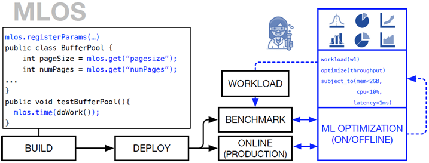
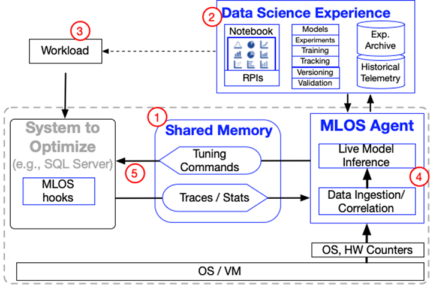

# MLOS: Machine Learning Optimized Systems

## MLOS: An Infrastructure for Automated Software Performance Engineering

> MLOS is an ML-powered infrastructure and methodology to democratize and automate Performance Engineering. MLOS enables continuous, instance-based, robust, and trackable systems optimization.

From the [MLOS paper at DEEM 2020](https://arxiv.org/abs/2006.02155)

## Overview

### Problem

All systems software (e.g. SqlServer, MySQL, LevelDB, OpenSSL, etc.) is full of parameter choices.

Sometimes these are encoded in the software as constants embedded in the code (e.g. choice of abstract data structure implementation, buffer limit size or alignment, etc.).
Other times they may be exposed as configuration parameters either at startup or runtime.

Careful selection of these parameters can yield dramatic performance differences for different _contexts_ of a system (e.g. different workloads, hardware, etc.).
Note that _performance_ can be interpreted in different ways (e.g. reducing average/variability of latency/memory, increasing throughput, decreasing MTTR, etc.)

Generally speaking, this process is referred to as *Software Performance Engineering*, and typically involves a lot of manual effort that is brittle and not well tracked.

### Goals

MLOS is about using machine-learning and data-science to optimize systems for a given context through these tunable choices.



Roughly, this can happen in two modes:

1. Offline (e.g. at development time)

    In this case, developers can use (micro)benchmarks to explore a parameter space for a component either interactively or with a background CI/CD pipeline and then interact with that data through a notebook experience to select the right value to check in to the code, along with the results of the experiments and analysis, all encoded in the notebook.

2. Online (e.g. at runtime)

    In this case a system component provides hooks to adjust its parameters at runtime and exports data about its current state/performance.  These can be combined with additional contextual information from the system to build a model (or simple heuristics) to invoke the hooks to adjust the component to improve performance at runtime.

### Architecture



To achieve this MLOS provides:

1. *Code Annotations* to help describe additional *settings metadata* for tunables (a.k.a. `Settings`).

    For instance, metadata can include things like constraints on acceptable values a Setting can take on as well as developer intuition to help guide the automated search process.

    Currently these are implemented as C# Attributes to provide reflection and easy cross-platform and cross-compiler support for C++ projects.

2. *Code Generation* tools to use that metadata to expose those settings to different target systems/languages (e.g. Python Notebooks, C++, C#, etc.)

    For instance, we generate efficient messages over shared memory communication channels for

    1. exporting data about the component using that Setting

        For instance, this may include performance statistics, workload traces, etc.

    2. receiving feedback (e.g. to change the Setting's value)

        This may involve a reconfiguration step or simply update a cache for the next instantiation to read.

3. An external agent (`Mlos.Agent.Server`) which can consume the information exported by the target system (e.g. SqlServer, MySQL, LevelDB, etc.) with mimimal impact on the target system.

    The external agent can perform workload summarization, binning, cataloging, model inference, heuristic invocation, etc. based on the events exposed by the target system to then influence it.

    Once hooks are created in the target system, iteration on the external agent can be more rapidly developed and deployed.


## Python only installation

Some of the examples require only the installation of the mlos Python library. These examples do not use the shared memory infrastructure.
To use this simplified installation, it's recommended to use the Anaconda python distribution and create a new conda environment:

```
    conda create -n mlos_environment
    conda activate mlos_environment
```

You can download the mlos code using git:

```
    git clone git@github.com:microsoft/MLOS.git
```

To install the Python library, change to the Python directory and install with ``pip``:

```
    cd MLOS/source/Mlos.Python
    pip install -e .
```

You can also install the package directly without checking out the code:

```
    pip install "git+https://github.com/microsoft/MLOS.git#egg=mlos&subdirectory=source/Mlos.Python"
```

However, this does not include the examples.

After this installation, you can run any of the Python-only example notebooks.
A good place to start is the [introduction to Bayesian Optimization](#).

## Full Build (C# and C++ components)

MLOS supports Windows and Linux build environments.

For detailed instructions, please refer to:

  1. [documentation/01-Prerequisites.md](./documentation/01-Prerequisites.md)
  2. [documentation/02-Build.md](./documentation/02-Build.md)

## Examples

Code and documentation for examples of using MLOS to optimize a system are described in [documentation/03-ExampleUsage.md](./documentation/04-ExampleUsage.md) and in the [source/Examples](./source/Examples/) tree.

## Documentation

- Additional overview documentation is available in the [documentation](./documentation/) tree.

- Individual components may also include more detailed documentation in their respective subdirectories.

## Contributing

We welcome contributions!  Please see [CONTRIBUTING.md](./CONTRIBUTING.md) and [CODE_OF_CONDUCT.md](./CODE_OF_CONDUCT.md) for details.

Also, please see the [Roadmap](TODOFIXME) of planned features.

## Contact

For more formal enquiries, you can [contact us](mailto:mlos-maintainers@service.microsoft.com).

## License

- [MIT License](./LICENSE)
