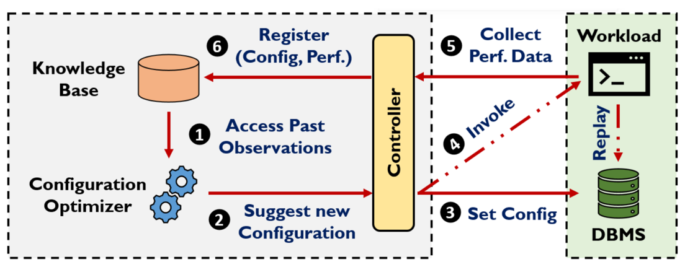

# MLOS

[](https://github.com/microsoft/MLOS/actions/workflows/devcontainer.yml)
[](https://github.com/microsoft/MLOS/actions/workflows/linux.yml)
[](https://github.com/microsoft/MLOS/actions/workflows/windows.yml)
[](https://microsoft.github.io/MLOS/htmlcov/index.html)

MLOS is a project to enable autotuning for systems.

## Contents

<!-- TOC -->

- [MLOS](#mlos)
    - [Contents](#contents)
    - [Overview](#overview)
    - [Organization](#organization)
    - [Contributing](#contributing)
    - [Getting Started](#getting-started)
        - [conda activation](#conda-activation)
        - [Usage Examples](#usage-examples)
            - [mlos-core](#mlos-core)
            - [mlos-bench](#mlos-bench)
            - [mlos-viz](#mlos-viz)
    - [Installation](#installation)
    - [See Also](#see-also)
        - [Examples](#examples)
        - [MLOS Viz Panel](#mlos-viz-panel)
    - [Usage](#usage)
        - [Running the Backend](#running-the-backend)
        - [Running the Frontend](#running-the-frontend)

<!-- /TOC -->

## Overview

MLOS currently focuses on an *offline* tuning approach, though we intend to add online tuning in the future.

To accomplish this, the general flow involves

- Running a workload (i.e., benchmark) against a system (e.g., a database, web server, or key-value store).
- Retrieving the results of that benchmark, and perhaps some other metrics from the system.
- Feed that data to an optimizer (e.g., using [Bayesian Optimization](https://en.wikipedia.org/wiki/Bayesian_optimization) or other techniques).
- Obtain a new suggested config to try from the optimizer.
- Apply that configuration to the target system.
- Repeat until either the exploration budget is consumed or the configurations' performance appear to have converged.

<!-- markdownlint-disable-next-line MD033 -->


> Source: [LlamaTune: VLDB 2022](https://arxiv.org/abs/2203.05128)

For a brief overview of some of the features and capabilities of MLOS, please see the following video:

[](https://aka.ms/MLOS/demo-video)

## Organization

To do this this repo provides two Python modules, which can be used independently or in combination:

- [`mlos-bench`](./mlos_bench/) provides a framework to help automate running benchmarks as described above.

- [`mlos-viz`](./mlos_viz/) provides some simple APIs to help automate visualizing the results of benchmark experiments and their trials.

    It provides a simple `plot(experiment_data)` API, where `experiment_data` is obtained from the `mlos_bench.storage` module.

- [`mlos-core`](./mlos_core/) provides an abstraction around existing optimization frameworks (e.g., [FLAML](https://github.com/microsoft/FLAML), [SMAC](https://github.com/automl/SMAC3), etc.)

  It is intended to provide a simple, easy to consume (e.g. via `pip`), with low dependencies abstraction to

  - describe a space of context, parameters, their ranges, constraints, etc. and result objectives
  - an "optimizer" service [abstraction](https://microsoft.github.io/MLOS/overview.html#mlos-core-api) (e.g. [`register()`](https://microsoft.github.io/MLOS/generated/mlos_core.optimizers.optimizer.BaseOptimizer.html#mlos_core.optimizers.optimizer.BaseOptimizer.register) and [`suggest()`](https://microsoft.github.io/MLOS/generated/mlos_core.optimizers.optimizer.BaseOptimizer.html#mlos_core.optimizers.optimizer.BaseOptimizer.suggest)) so we can easily swap out different implementations methods of searching (e.g. random, BO, LLM, etc.)
  - provide some helpers for [automating optimization experiment](https://microsoft.github.io/MLOS/overview.html#mlos-bench-api) runner loops and data collection

For these design requirements we intend to reuse as much from existing OSS libraries as possible and layer policies and optimizations specifically geared towards autotuning systems over top.

By providing wrappers we aim to also allow more easily experimenting with replacing underlying optimizer components as new techniques become available or seem to be a better match for certain systems.

## Contributing

See [CONTRIBUTING.md](./CONTRIBUTING.md) for details on development environment and contributing.

## Getting Started

The development environment for MLOS uses [`conda`](https://docs.conda.io/projects/conda/en/latest/user-guide/install/index.html) and [`devcontainers`](https://code.visualstudio.com/docs/remote/containers) to ease dependency management, but not all these libraries are required for deployment.

For instructions on setting up the development environment please try one of the following options:

- see [CONTRIBUTING.md](./CONTRIBUTING.md) for details on setting up a local development environment
- launch this repository (or your fork) in a [codespace](https://github.com/features/codespaces), or
- have a look at one of the autotuning example repositories like [sqlite-autotuning](https://github.com/Microsoft-CISL/sqlite-autotuning) to kick the tires in a [codespace](https://github.com/features/codespaces) in your browser immediately :)

### `conda` activation

1. Create the `mlos` Conda environment.

     ```sh
    conda env create -f conda-envs/mlos.yml
    ```

    > See the [`conda-envs/`](./conda-envs/) directory for additional conda environment files, including those used for Windows (e.g. [`mlos-windows.yml`](./conda-envs/mlos-windows.yml)).

   or

    ```sh
    # This will also ensure the environment is update to date using "conda env update -f conda-envs/mlos.yml"
    make conda-env
    ```

    > Note: the latter expects a *nix environment.

1. Initialize the shell environment.

    ```sh
    conda activate mlos
    ```

### Usage Examples

#### `mlos-core`

For an example of using the `mlos_core` optimizer APIs run the [`BayesianOptimization.ipynb`](./mlos_core/notebooks/BayesianOptimization.ipynb) notebook.

#### `mlos-bench`

For an example of using the `mlos_bench` tool to run an experiment, see the [`mlos_bench` Quickstart README](./mlos_bench/README.md#quickstart).

Here's a quick summary:

```shell
./scripts/generate-azure-credentials-config > global_config_azure.jsonc

# run a simple experiment
mlos_bench --config ./mlos_bench/mlos_bench/config/cli/azure-redis-1shot.jsonc
```

See Also:

- [mlos_bench/README.md](./mlos_bench/README.md) for more details on this example.
- [mlos_bench/config](./mlos_bench/mlos_bench/config/) for additional configuration details.
- [sqlite-autotuning](https://github.com/Microsoft-CISL/sqlite-autotuning) for a complete external example of using MLOS to tune `sqlite`.

#### `mlos-viz`

For a simple example of using the `mlos_viz` module to visualize the results of an experiment, see the [`sqlite-autotuning`](https://github.com/Microsoft-CISL/sqlite-autotuning) repository, especially the [mlos_demo_sqlite_teachers.ipynb](https://github.com/Microsoft-CISL/sqlite-autotuning/blob/main/mlos_demo_sqlite_teachers.ipynb) notebook.

## Installation

The MLOS modules are published to [pypi](https://pypi.org) when new releases are tagged:

- [mlos-core](https://pypi.org/project/mlos-core/)
- [mlos-bench](https://pypi.org/project/mlos-bench/)
- [mlos-viz](https://pypi.org/project/mlos-viz/)

To install the latest release, simply run:

```sh
# this will install just the optimizer component with SMAC support:
pip install -U mlos-core[smac]

# this will install just the optimizer component with flaml support:
pip install -U "mlos-core[flaml]"

# this will install just the optimizer component with smac and flaml support:
pip install -U "mlos-core[smac,flaml]"

# this will install both the flaml optimizer and the experiment runner with azure support:
pip install -U "mlos-bench[flaml,azure]"

# this will install both the smac optimizer and the experiment runner with ssh support:
pip install -U "mlos-bench[smac,ssh]"

# this will install the postgres storage backend for mlos-bench
# and mlos-viz for visualizing results:
pip install -U "mlos-bench[postgres]" mlos-viz
```

Details on using a local version from git are available in [CONTRIBUTING.md](./CONTRIBUTING.md).

## See Also

- API and Examples Documentation: <https://microsoft.github.io/MLOS>
- Source Code Repository: <https://github.com/microsoft/MLOS>

### Examples

- [mlos-autotuning-template repository](https://github.com/microsoft/mlos-autotuning-template)

- [sqlite-autotuning](https://github.com/Microsoft-CISL/sqlite-autotuning)

    Working example of tuning `sqlite` with MLOS.

These can be used as starting points for new autotuning projects.
