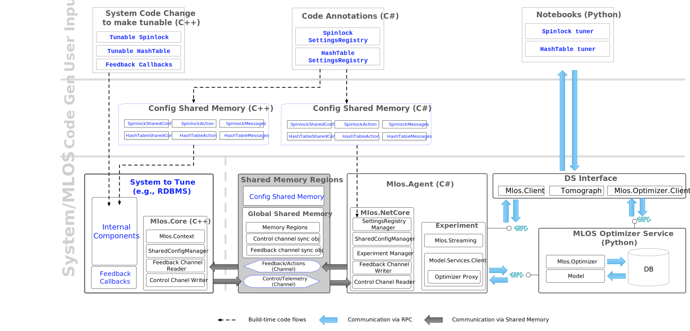

# MLOS Architecture

This document provides a brief overview of the MLOS architecture for supporting **M**achine **L**earning **O**ptimized **S**ystems.

- [MLOS Architecture](#mlos-architecture)
  - [High Level Description](#high-level-description)
    - [Principles](#principles)
    - [Workflows](#workflows)
  - [Architecture Diagram](#architecture-diagram)
    - [Main components](#main-components)
    - [Shared Memory Regions](#shared-memory-regions)
    - [Target Process](#target-process)
      - [Mlos.Core](#mloscore)
      - [Shared Channel](#shared-channel)
    - [Mlos.Agent](#mlosagent)
      - [Mlos.NetCore](#mlosnetcore)
      - [Settings registry assemblies](#settings-registry-assemblies)
      - [Grpc Server](#grpc-server)
      - [Experiment management](#experiment-management)
  - [Implementation details](#implementation-details)

## High Level Description

At a high level, MLOS provides infrastructure to support instance-specific tuning systems software (e.g. written in C++) in a trackable and reproducible way.

MLOS does this by focusing on optimizing *tunables* that exist in code.

*Tunables* can take several forms:

- *Build time*
  - e.g. inlined constants controlling buffer size or hash function, choice of concrete ADT implementation, etc.
- *Startup*
  - e.g. configurations that can only be changed with a process restart
- *Runtime*
  - e.g. dynamic settings that can changed between instantiations, queries, or other events.
  - Some of these may be known at compile-time, while others may only be known at runtime for a specific instance (e.g. number of tables in a database schema).

To optimize these tunables, the system needs to be observable.
In other words, it needs to provide additional data (e.g. *workload*, *telemetry*, *metrics*, etc.) about the its operation.
When combined additional information obtained from the system executing the process (e.g. OS/HW metrics), we call this combined set of information the *context*.

### Principles

- *Separation*

  To support lightweight observable components with minimal impact on the target system's performance, we separate the data aggregation and optimization steps to a (local) *external agent* process.
  It communicates with the target system using *shared memory channels* for low latency.

- *Segmentation*

  To support faster iteration, we allow focusing build-time constant tuning to specific components of the target system using micro benchmarks.

### Workflows

MLOS workflows take roughly two basic forms:

1. Build-time optimization

    *Microbenchmarks* develepers write for *smart components* can be used to explore component tunable parameter values either interactively or in the background (e.g. during continuous integration pipelines).

    The data collected from those "experiments" can be captured and explored in Notebook experiences that can then be checked back in with the resulting code change to help support reproducible tests to validate these parameters in the future.

    Since these tunables may affect many instances, optimization goals here may focus on robustness in addition to performance or some other metric.

2. Runtime optimization

    *Smart components* can be hooked up to receive suggestions from the *external agent* during runtime for online instance specific optimizations as well.

## Architecture Diagram

### Main components

- *Target process*

  This is the MLOS enabled system to tune (e.g. an end-to-end system like SqlServer or *Smart* micro benchmarks for a component, etc.).
  The process contains tunable "*Smart*" components that are made observable by the *Mlos.Agent* by exporting telemetry/metrics over *Shared memory channels* and are optimized using *Mlos.Optimizer.Service* suggestions.

- *Mlos.Agent*

  The primary responsibility of the *Mlos.Agent* is to observe the target process and manage the "experiments".
  The experiments define the aggregates from the telemetry stream and exchange it with *Mlos.Optimizer.Service*.

- *Mlos.Client*

  The *Mlos.Client* is a utility application that allows us to query the state of shared components and create new experiments.

- *Shared memory*

  *Shared memory* regions are used to exchange messages and share the configuration objects between the *Target process* and the *Mlos.Agent*.

- *Mlos.Optimizer.Service*

  *Mlos.Optimizer.Service* is a Docker instance containing the *Mlos.Optimizer* and an RDBMS instance (e.g. SqlServer) for storing experiment data, optimizer models, etc.

  To exchange the messages between *Mlos.Agent* experiments and *Mlos.Optimizers*, the database is currently used as a transport channel.

### Shared Memory Regions

- *Global Shared Memory*

  The primary shared memory entry point.
  It used to bootstrap and contains metadata about all other memory regions.
  It also includes shared channel synchronization objects.

- *Config Shared Memory*

  We store all components' configuration in the *config shared memory* region.
  Configuration objects are accessible from the *Target process* and from *Mlos.Agent*.

- *Control/Telemetry Channel Shared Memory*

  Memory region used (exclusively, no header) to exchange messages from the *Target process* to *Mlos.Agent*.

- *Feedback Channel Shared Memory*

  A memory region used (exclusively, no header) to exchange messages from *Mlos.Agent* to *Target process*.

Some memory regions contain a header block that helps with their identification.
The exceptions are shared channel memory regions, where the channel uses all memory.
Control and Feedback Channels are circular buffers whose size must be a power of two (2<em>N</em>).
Prepending a header would prevent proper alignment which is why all communication channel metadata and synchronization objects are located in the _Global Shared Memory_ region.

See Also: [SharedChannel.md](../source/Mlos.Core/doc/SharedChannel.md) for more details about their implementation.

### Target Process

#### Mlos.Core

*Mlos.Core* is a (C++) library used inside the target process.
It provides an API to handle shared configs and exchange messages with *Mlos.Agent* via a shared channel.

*Mlos.Core* contains the following components:

- *MlosContext*

  A class responsible for managing shared memory channels.
  It provides methods for sending *telemetry* and *control* messages to the *Mlos.Agent* as well as receiving *feedback* messages from it.

- *SharedConfigManager*

  A class responsible for managing shared configs.
  It allows for registering configs in shared memory.

#### Shared Channel

- *Control Channel*
- *Feedback Channel*

### Mlos.Agent

#### Mlos.NetCore

#### Settings registry assemblies

#### Grpc Server

#### Experiment management

## Implementation details

[Shared Memory Channel](../source/Mlos.Core/doc/SharedChannel.md)
