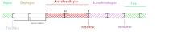
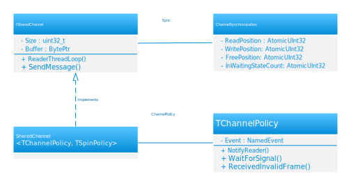

# MLOS Shared Channel

This document describes the implementation details of the mechanism (a shared memory communication channel) used for a target system to communicate with an external agent for tuning it.

For additional context, please see the [MlosArchitecture.md](../../../documentation/MlosArchitecture.md) documentation.

See [source/Mlos.Core](../#mlos-github-tree-view) to browse the code.

## Contents

- [MLOS Shared Channel](#mlos-shared-channel)
  - [Contents](#contents)
  - [Shared Channel](#shared-channel)
    - [Principles](#principles)
    - [Circular buffer algorithm](#circular-buffer-algorithm)
      - [Writer](#writer)
      - [Reader](#reader)
      - [Writer continued](#writer-continued)
      - [Reader continue](#reader-continue)
      - [Cyclic buffer handling](#cyclic-buffer-handling)
    - [Scaling out readers](#scaling-out-readers)
  - [Shared channel implementation](#shared-channel-implementation)
    - [Diagram](#diagram)
    - [Policies](#policies)
    - [Notes](#notes)

## Shared Channel

A *shared channel* is a one-directional communication channel based on a single shared memory block (i.e. between processes).
It supports multiple concurrent writers and readers.

Its purpose is to allow exposing information from a target system to an external agent (e.g. `Mlos.Agent`) and providing feedback from that external agent to control the target system's tunables.

Typically there are several shared channels in each system:

- A *control* channel for registering settings to setup up additional channels.
- One or more (e.g. for each tunable component) *telemetry* and *feedback* channel pairs.

Messages are exchanged on a shared channel as _Frames_.
Frames can be variable length (e.g. if they include variable length data like strings) or fixed length (e.g. just numerical data).
The format of each frame is code generated by `Mlos.SettingsSystem.CodeGen` from annotated C# data structures specified in a `SettingsRegistry` provided by the developer.
See [Mlos Settings System Code Generation](../../Mlos.SettingsSystem.CodeGen/) more details on the code generation and settings system.

### Principles

The shared channel is comprised of four contiguous memory regions (though at times some of them could have zero size):

  1. _FreeRegion_ - a writer can acquire the region by (atomically) saving the original _WritePosition_, and advancing _WritePosition_ by the frame size. The writer can then write the frame at the _WriteOffset_ = (original _WritePosition_) % Buffer.Size.
  2. _DirtyRegion_ - contains already processed (read) frames that are ready to be reclaimed (as indicated in the frame's header). Writers are responsible for reclaiming frames and advancing the _FreePosition_.
  3. _ActiveReadsRegion_ - a memory region between the start of the oldest unprocessed frame start and the _ReadPosition_ (logically) or _ReadOffset_ (physically). Readers are actively processing messages in this region.
  4. _ActiveWritesRegion_ - a memory region between the _ReadPosition_ and _WritePosition_ (logically) or equivalently between _ReadOffset_ and _WriteOffset_ (physically). This region contains both:
      - Frames that have already been written but have not been processed yet, and
      - Frames that are being written by the writers.

      These two types of frames are differentiated by information contained in their headers (described below).

At the __logical level__ the boundaries between the regions are controlled by three position variables that are atomically updated:

  1. _WritePosition_
  2. _ReadPostion_
  3. _FreePosition_

They are all 32-bit unsigned integers that are monotonically increasing except for integer overflows. Note that integer overflows are part of the design and do not affect correctness.

At the __physical level__ the boundaries between the regions are controlled by corresponding offsets into the circular buffer:

  1. _WriteOffset_ = _WritePosition_ % Buffer.Size
  2. _ReadOffset_ = _ReadPosition_ % Buffer.Size
  3. _FreeOffset_ = _FreePosition_ % Buffer.Size

- Advancing positions is implemented with atomic CPU operations (e.g. `std::atomic::compare_exchange` or `Interlocked.CompareExchange`).
- Reader and writer threads must use these to first *acquire* a region before touching the memory inside it.  There are two exceptions to this rule:
  1. when thread reads from memory in unknown state
  2. cleanup does not require *acquire*, it just cleans up (atomically) as far as it's safe to do so
- The following invariant ensures that the _ActiveWritesRegion_ will never overlap the _ActiveReadsRegion_ \

  _FreePosition_ <= _ReadPosition_ <= _WritePosition_ < _FreePosition_ + _Buffer.Size_

- _Buffer.Size_ must be a power of two (2<em>N</em>)

### Circular buffer algorithm

#### Writer

Writer threads expand an _ActiveWriteRegion_ by atomically exchanging _WritePosition_ by a frame length.
If it succeeds, it means the writer has acquired the memory region and can write the frame.
The _ActiveWriteRegion_ will never overlap with _ActiveReadsRegion_. The writer ensures there is a minimum gap of the size of _FrameHeader_ between _FreeOffset_ and _WriteOffset_.
The writer stores the frame payload and atomically updates the frame length.

#### Reader

By default reader threads spin [1] on the _ReadOffset_ which always points to the length of the next written frame.
When the value becomes available (_Frame.Length_ > 0), it tries to acquire the region by atomically exchanging _ReadPostion_.
If the compare and exchange fails, it means another reader thread is already processing the frame.
When it succeeds, the reader should call the proper dispatcher routine to process the contents of the frame.
After processing the frame, the reader clears the frame payload and atomically updates the _Frame.Length_ to be negative [2], indicating that it is available to be written again.

> [1] Alternative [policies](#policies) can be specified to control sleeping vs spinning behavior.
>
> [2] It is possible that the reader crashes between these steps.  We use reference counting to support detecting these situations.

#### Writer continued

Now, the memory occupied by the frame the reader finished with is clear, except for the negative _Frame.Length_.
Writer threads use negative frame lengths as a hint to advance _FreePosition_ until _DirtyRegion_ has a minimal size (according to the invariant above).

#### Reader continue

When the reader waits on the _ReadOffset_, it reads from the memory region that has not been acquired.
This is the _FreeRegion_, and the memory has been cleared by the previous reader - except for the negative _Frame.Length_.
The *Offset* of the frame is always aligned to `sizeof(uint32_t)`, so if the current *ReadOffset* is the same as the offset of the old processed frame, the reader will read a negative value.
So, the reader will spin until it reads positive frame length.

#### Cyclic buffer handling

If a writer is unable to write a full frame (i.e. the end of the frame is greater than buffer margin), it will write an empty frame (no payload) just to advance _Position_ to the beginning of the buffer.

Readers can identify these empty frames using their `CodeGenTypeIndex` header, and pass over them.

### Scaling out readers

To scale out the number of reader threads, we introduced a control bit which defines if the frame has been fully written.
The control bit (`Done` in the diagram above) is the lowest bit in the frame length field.

With the modified algorithm, the writer stores the length of the frame with the `Done` bit set to 0.
This allows one reader to acquire the current frame region while other readers threads can advance and wait for the next frame.

## Shared channel implementation

### Diagram

### Policies

The implementation allows the use of different policies using the same shared memory buffer instance.

Policies are responsible for:

- error handling
- cross process notification
- handling full buffer
- spinning implementation

The shared channel requires two policies.

1. `TSpinPolicy` is responsible for the spin/wait algorithm when a frame is not available.

2. `TChannelPolicy` implements error handling code and cross-process notification.

`TSpinPolicy` is a local variable in functions that require spin functionality whereas `TChannelPolicy` is a field in `SharedChannel` class.

We do not share `TSpinPolicy` across multiple writers, so each thread creates its own object.
The `SharedChannel` contains a single instance `TChannelPolicy` which contains a synchronization primitive used to signal remote process when there is a new frame.

### Notes

The implementation of shared channel is heavily influenced by C# metaprograming:\
[Federico Lois — Metaprogramming for the masses](https://www.youtube.com/watch?v=UybGH0xL5ns)
