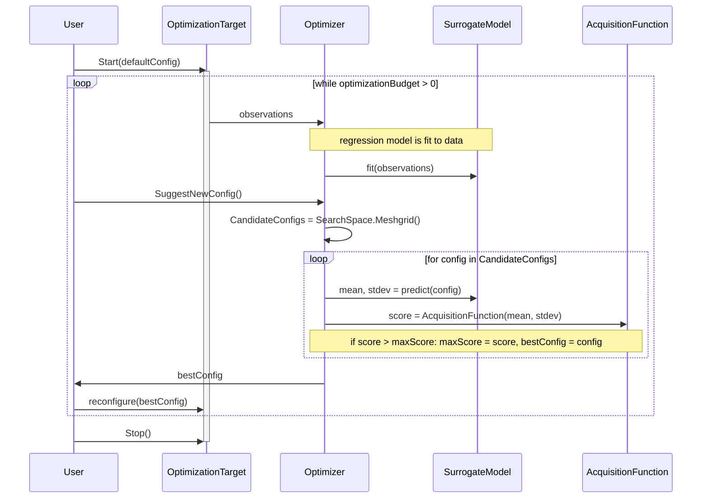

# Bayesian Optimizer V1

The goal of this document is to describe the architecture and inner workings of a Bayesian Optimizer.

# Components

The following components will be necessary:
1. Experiment
2. Observation Storage (Table in SQL Server)
3. Bayesian Optimizer
4. Surrogate Models

# Architecture

TODO: describe how we will use the technologies:
* Docker (K8S?)
* SQL Server
* Python
* ML.Net
* SQL DB RPC vs. gRPC

# Experiment
An experiment interacts with the Bayesian Optimizer in the following ways:
1. It submits observations.
2. It requests suggestions.

Obviously an experiment and the corresponding bayesian optimizer have to be compatible so that the observations generated by the experiment are within the optimizers observation space. Thus the Experiment and the Optimizer should be configured together. One way to accomplish this is to have the __Experiment own an Optimizer__. 

An experiment has to further interact with the target. There are two general approaches:
1. Active Learning
2. Online Learning

## Active vs. Online Learning

### Active Learning
In this mode the experiment controls the deployment and the workload. In other words, the experiment can restart the target with a desired configuration, in a desired context, with a desired workload.

__A mental shortcut__: we would use this mode in the lab to train models.

### Online Learning
In this mode the experiment can observe the target (its deployment context, and performance metrics) but is only allowed to change the configuration. 

__A mental shortcut__: we would use this mode in production.

## Explore vs. Exploit
While we are talking about training modes, another dichotomy should be made clear.

We would run the optimizer in an __Explore__ mode in the lab or on a 'B' instance of an A/B testing setup. We would only ever run the optimizer in the __Exploit__ mode on production deployments, but that's the song of distant future.

The mechanism for controlling the behavior would be to adjust the acquisition function. 

### Explore
In Explore mode the optimizer's objective is to explore the search space with the goal of sampling a variety of configurations and building robust surrogate models. This comes at a risk of drastically regressing performance or even crashing the server, but we are OK with that in the lab setting. The payoff is that the optimizer builds models that more completely understand the _feasibility region_ as well as the performance of the target under various configurations.

### Exploit
In Exploit mode the optimizer's objective is to __conservatively__ adjust target's configuration to maximize performance in a given workload. What this means is that the optimizer would only issue a reconfiguration recommendation if it has a very low probability of deteriorating performance.

# Storage

Observations obtained from the target should be passed to the optimizer, but additionally should be stored so that we could experiment with a variety of models. For now, we will use SQL Server as storage for observations, though we could extend it to any other technology as long as required connectors are available / can be written.

# Bayesian Optimizer

## Anatomy of a Bayesian Optimizer
A Bayesian Optimizer (BO) consists of two parts, both of which can be interchanged to achieve a variety of goals. Thes are:
* An acquisition function
* A surrogate model or surrogate models ensemble

### Simple optimization flow

Below is a sequence diagram depicting a simple bayesian optimization process.

While this process is quite naive, it allows us to discuss the way that a Bayesian Optimizer works.

1. The user starts the OptimizationTarget which emits telemetry. Automagically (in a way irrelevant to our discussion) that telemetry is converted to observations and passed to the optimizer. The optimizer uses all observations to fit a surrogate model (let's assume it's a Gaussian Process).
1. Eventually, the user is ready to try a new configuration and so the user asks the optimizer for a new config to try.
1. The optimizer generates a meshgrid of possible configurations.
1. The model is asked to predict performance and uncertainty for each of the points in the grid. 
1. Those predictions are passed through an acquisition function which returns some score. That function could be: probability of improvement, expected improvement, lower confidence bound, or even an inverse of the probability of catastrophic deterioration. This choice depends on our objective and our constraints. More on that later.
1. The optimizer selects the configuration with the highest score and returns to the user.
1. The user reconfigures the target and the story repeats until we run out of budget.

### The Role of the Surrogate Model
That role is very simple: predict performance based on configuration. Ideally, a surrogate model should report it's level of uncertainty in the prediction.

TODO: feasibility predictors

### The Role of the Acquisition Function
The role of the acquisition function is difficult to overstate. It is this function that __determines whether the optimizer is in an Explore vs. Exploit mode__. An acquisition function can score each candidate configuration in a number of ways: it can favor configurations close to existing observations so that the risk is minimized. It can favor _promising and uncertain_ configurations to favor exploration.

Some of the popular choices:
* Probability of Improvement (POI) - maximizes the chance that a new point will be better than the observations we have seen so far. 
* Expected Improvement (EI) - will select points maximize expected improvement. It much less conservative than POI. POI would select points with high chance of improvement, even if the improvement is infinitesimal. EI will select points so that the improvement is as large as possible.
* Lower Confidence Bound - will select poinst with __the highest lower confidence bound__. In a way it is a strategy that is motivated by avoiding risk rather than winning big. 
* Safe Optimization - this function will attempt to minimize the probability of suggesting a catastrophic configuration. In other words: maximize the probability of safety.

Each of the above functions can be further parameterized to tune it to our needs. It is a very rich selection and should be addressed by hyper-parameter tuning and AutoML initiatives.

### Maximizing Acquisition Function
In our naive example above, we used grid search maximize the value of hte Acquisition Function. That is obviously wasteful especially when we realize that we will repeat this step over and over again, for every new suggestion (iteration of the outer loop). Several observations can prove useful:
1. The surrogate model changes only slightly between iterations and those changes are most pronounced in the vicinity of the new observation.
2. It stands to reason that between iterations points that had a high acquisition function value are likely to stay promising, and points that had a low acquisition value function are likely to remain unpromising. With the exception of points in the vicinity of any new observations.

We could use that insight to jump-start our optimization by first considering points that have been promising in the past.

Furthermore, some surrogate model classes can encode clues to their maxima. For example: in a Gaussian Process maxima are likely to occur in the vicinity of the kernels. 

Moreover, a plethora of optimization algorithms have been developed over the centuries that should perform better than grid search (especially for smooth functions such as Neural Networks and Gaussian Processes sometimes are). There are direct methods, gradient based methods (first and second order), population methods and even surrogate methods (... though that last suggestion is bound to raise eye-brows - but that alone should not disqualify it :)).

The point is, by using some of those methods, we are likely to converge on optima faster and save a lot of compute on model scoring.

# Surrogate Models
TODO: describe the types: 
* performance regression models
* feasibility classification models

