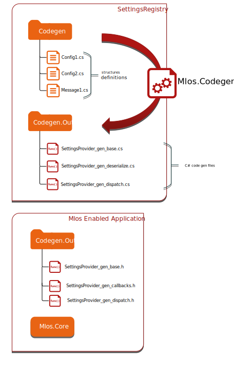

# MLOS Settings System Code Generation

This document provides some documentation on the implementation internals of the [MLOS Settings System Code Generation](./#mlos-github-tree-view) process.

## Contents

- [MLOS Settings System Code Generation](#mlos-settings-system-code-generation)
  - [Contents](#contents)
  - [Why code generation?](#why-code-generation)
  - [Why custom CodeGen?](#why-custom-codegen)
    - [Performance](#performance)
    - [Then why not XEvents?](#then-why-not-xevents)
    - [Benefits](#benefits)
  - [Build process](#build-process)
  - [Classes](#classes)
  - [Hierarchy of CodeWriters](#hierarchy-of-codewriters)
    - [Namespaces](#namespaces)
  - [Basic structure generation](#basic-structure-generation)
    - [CppObjectCodeWriter](#cppobjectcodewriter)
    - [CppProxyCodeWriter](#cppproxycodewriter)
    - [CppEnumCodeWriter](#cppenumcodewriter)
  - [Serialization](#serialization)
    - [Basics](#basics)
    - [Current implementation](#current-implementation)
    - [Alternative](#alternative)
    - [CppObjectSerializeCodeWriter](#cppobjectserializecodewriter)
    - [CppObjectSerializedLengthCodeWriter](#cppobjectserializedlengthcodewriter)
  - [Runtime callback handlers](#runtime-callback-handlers)
    - [CppObjectDeserializeRuntimeCallbackCodeWriter](#cppobjectdeserializeruntimecallbackcodewriter)
    - [CppObjectDeserializeFunctionCallbackCodeWriter](#cppobjectdeserializefunctioncallbackcodewriter)
  - [See Also](#see-also)

## Why code generation?

A goal of MLOS is to provide the ability to expose internal application settings, telemetry (metrics, status, etc.), and events to an external agent.

This allows observing and tuning the system with minimal impact on its runtime.

The MLOS code generation process is responsible for generating a set of classes and helper methods to exchange the messages and share (read and update) config structures between the target application and the external agent.
The current mechanism does this using shared memory.

The intended purpose of this is to allow the developer to more succinctly specify the settings and some metadata about them (e.g. default and valid range of values) for use in several different domain specific languages (e.g. C++ for systems code, Python for data science, etc.).

## Why custom CodeGen?

Not [Protocol Buffers](https://developers.google.com/protocol-buffers), [FlatBuffers](https://google.github.io/flatbuffers/), SqlServer XEvents, etc.

The answer is performance and full control.
Emitting the telemetry will occur on the hot path (_not always_).
We must make sure that we keep code sending the telemetry short and fast as possible.
On SKUs with small CPU count, the telemetry code will extend the critical path.
The ability to recover the application depends (_among others_) on the exchange framework.

Additionally, some of the existing solutions do not integrate well with some (internal) codebases (e.g. due to use of certain STL features).

### Performance

Interesting benchmarks can be found here [bitsery](https://github.com/fraillt/cpp_serializers_benchmark)

| method           | data size | serialize | deserialize |
|------------------|-----------|-----------|-------------|
| bitsery          | 6913B     | 1252ms    | 1170ms      |
| bitsery_compress | 4213B     | 1445ms    | 1325ms      |
| boost            | 11037B    | 9952ms    | 8767ms      |
| cereal           | 10413B    | 6497ms    | 5470ms      |
| flatbuffers      | 14924B    | 6762ms    | 2173ms      |
| yas              | 10463B    | 1352ms    | 1109ms      |
| yas_compress     | 7315B     | 1673ms    | 1598ms      |

### Then why not XEvents?

XEvents generates code responsible for emitting the telemetry; MLOS CodeGen creates both sender and the receiver side.
MLOS CodeGen creates additional code required for shared config lookups.
MLOS CodeGen also allows annotating attributes with additional metadata for data science purposes.

### Benefits

- full control over the code, no external dependencies
- clean and simple implementation, we are using C# type system (class definitions and attributes) and reflection,
- simple, extensible architecture
  to add new language support, just add CodeWriters (for example Python Cpp bindings).
- easy to integrate with SqlServer (no Cpp standard or open source libraries incompatible with SOS memory management and error handling)
- easy to open source (no proprietary dependencies)

## Build process

Codegen works on the types definied in C# assembly. This assembly is called *SettingsRegistry*. The project definition has a group of files that are included in the code generation workflow.

```xml
<ItemGroup Label="SettingsRegistryDefs">
  <!--
      This one uses an assembly level attribute to declare the output
      namespace for the code.
  -->
  <SettingsRegistryDef Include="Codegen/AssemblyInfo.cs" />
  <!--
      This one defines the settings and message types.
  -->
  <SettingsRegistryDef Include="Codegen/SharedChannelConfig.cs" />
</ItemGroup>
<ItemGroup>
  <!--
      This one provides the message handler code of those messages for the
      Mlos.Agent (C#).
  -->
  <Compile Include="AssemblyIntializer.cs" />
</ItemGroup>
```

First codegen internally compiles files marked as `SettingsRegistryDef` to a temporary assembly.
From this assembly, codegen uses reflection to discover all the types that are marked with special C# attributes from `Mlos.SettingsSystem.Attributes` and process the types though a chain of codegen classes.

For instance, a `struct` may be marked with `[CodeGenConfig]` (i.e. the `CodeGenConfigAttribute`) and the settings within it may be marked with `[ScalarSetting]` (i.e. the `ScalarSettingAttribute`).

As results codegen produces a series of `SettingsProvider_gen_*.*` files in `out/Mlos.CodeGen.out/`.
We can group them (currently) into two categories:

1. C++ files (`.h` extension),
2. C# files (`.cs` extension).

   C# files are compiled with other project files into final settings registry assembly.

C++ files are compiled with the client application.



## Classes

CodeGen consist multiple _CodeWriter_ types.
Each _CodeWriter_ is responsible for providing a small subset of functionality.
_CodeWriters_ results are combined into single or multiple files; each _CodeWriter_ specifies the output file as one of its properties.

## Hierarchy of CodeWriters

### Namespaces

- `Mlos.SettingsSystem.CodeGen.CodeWriters.CppTypesCodeWriters`

  - CodeGens in this namespace write Cpp struct and proxy view definitions.

- `Mlos.SettingsSystem.CodeGen.CodeWriters.PythonCodeWriters`

  - Creates python bindings.

- `Mlos.SettingsSystem.CodeGen.CodeWriters.CppObjectExchangeCodeWriters`

  - Creates set of classes and functions that enables exchange generated objects.

    This includes helper classes returning type index, serialization and deserialization handlers.

## Basic structure generation

### CppObjectCodeWriter

Creates a regular C++ structure based on a C# type.

From the following C# code:

```CSharp
namespace Mlos.Core.Channel
{
    /// <summary>
    /// Shared circular buffer channel settings.
    /// </summary>
    struct ChannelSettings
    {
        /// <summary>
        /// Size of the buffer.
        /// To avoid arithmetic overflow, buffer size must be power of two.
        /// </summary>
        int BufferSize;

        /// <summary>
        /// Number of reader using this channel.
        /// </summary>
        int ReaderCount;
    }
}
```

From this definition _CppObjectCodeWriter_ generates code:

```C++
namespace MLOS
{
namespace Core
{
namespace Channel
{
    // Shared circular buffer channel settings.
    //
    struct ChannelSettings
    {

        // Size of the buffer.
        // To avoid arithmetic overflow, buffer size must be power of two.
        //
        int32_t BufferSize;

        // Number of reader using this channel.
        //
        int32_t ReaderCount;
    };
}
}
}
```

Note that the code gen output is using C# namespaces.

### CppProxyCodeWriter

Creates a view to a C++ structure. To be more precise, creates a view to serialized form of the structure.
Allows to read structure fields after they are serialized in the exchange buffer.

```C++
namespace Proxy
{

namespace MLOS
{
namespace Core
{
namespace Channel
{

struct ChannelReaderStats : public PropertyProxy<ChannelReaderStats>
{
    typedef ::MLOS::Core::Channel::ChannelReaderStats RealObjectType;

    ChannelReaderStats(FlatBuffer& flatBuffer, uint32_t offset = 0)
     :  PropertyProxy<ChannelReaderStats>(flatBuffer, offset)
    {}
    PropertyProxy<uint64_t> MessagesRead = PropertyProxy<uint64_t>(flatBuffer, offset + 0);
    PropertyProxy<uint64_t> SpinCount = PropertyProxy<uint64_t>(flatBuffer, offset + 8);
};

}
}
}

}
```

CppProxyCodeWriter creates objects in a **Proxy** namespace, so we can easily distinguish between the structure and its proxy.

```C++
MLOS::Core::Channel::ChannelReaderStats object;
Proxy::MLOS::Core::Channel::ChannelReaderStats proxyView;
```

### CppEnumCodeWriter

Creates a C++ enums. As enum is a primitive type, there is no proxy class for the enum types.

```CSharp
enum Colors : ulong
{
    Red = 2,
    Green = 5,
    Blue = 9
};
```

```C++
enum Colors : uint64_t
{
    Red = 2,
    Green = 5,
    Blue = 9,
};
```

## Serialization

### Basics

Serialization of messages requires a type identifier.
The identifier must be the same for the sender and for the receiver.
The (C++) sender needs to know the type id during compilation, so the function returning the type identifier must use a `constexpr` modifier.
The receiver uses the type id to find and call proper the handler as a lookup in a dispatch table constructed at compile time.
The (C#) receiver does not need to know type identifier during the compilations and dispatch invocation is always dynamic.

### Current implementation

For each type, CodeGen creates a specialized method `TypeMetadataInfo::Index<T>` which returns a unique id.
To simplify the dispatcher code, ids are simply type indexes.

```Cpp
namespace TypeMetadataInfo
{
    template<typename T>
    static constexpr uint32_t Index();

    template <>
    constexpr uint32_t Index<Point>() { return DispatchTableBaseIndex() + 1; }

    template <>
    constexpr uint32_t Index<Point3D>() { return DispatchTableBaseIndex() + 2; }

    template <>
    constexpr uint32_t Index<Line>() { return DispatchTableBaseIndex() + 3; }
    ...
}
```

The CodeGen is creating a dispatcher table:

```Cpp

__declspec(selectany) ::MLOS::Core::DispatchEntry DispatchTable[] =
   {
       ::MLOS::Core::DispatchEntry
       {
           TypeMetadataInfo::Index<::SqlServer::Spatial::Point>(),
           [](FlatBuffer&& buffer)
           {
               Proxy::SqlServer::Spatial::Point recvObjectProxy(buffer);
               ObjectDeserializationCallback::Deserialize(std::move(recvObjectProxy));
           }
       }
       ...
   }
```

Because we are using type indexes, finding a dispatcher routine is a matter of simple table lookup.
To verify if the sender and receiver processes are using the same table, the sender will  include the hash created from the type definition.
That allows receiver to reject invalid/type mismatched frames.

Special steps are required to enable usage of multiple dispatch tables.
Each dispatch table must have a unique base index.
All type indexes included in this dispatch table will be incremented by the base table index.
Base index of next dispatch table is equal to base index of the previous table plus number of types of previous table.

```Cpp
// Base indexes for all included dispatcher tables.
//
constexpr uint32_t MLOS::Core::Channel::ObjectDeserializationHandler::DispatchTableBaseIndex()
{
    return 0;
}
constexpr uint32_t SqlServer::Spatial::ObjectDeserializationHandler::DispatchTableBaseIndex()
{
    return MLOS::Core::Channel::ObjectDeserializationHandlerHandler::DispatchTableElementCount();
}
```

The global dispatch table (a concatenation of all included dispatch tables) is created as a compile time constant for efficiency.

```Cpp
constexpr auto GlobalDispatchTable()
{
    auto globalDispatchTable = MLOS::Core::DispatchTable<0>()
        .concatenate(MLOS::Core::Channel::ObjectDeserializationHandler::DispatchTable)
        .concatenate(SqlServer::Spatial::ObjectDeserializationHandler::DispatchTable);

    return globalDispatchTable;
}
```

### Alternative

Use type hash as identifier.
Receiver would need to perform a lookup (e.g. hashmap, if/else sequence, binary search, binary search with if/else sequence) to find the correct dispatch function.

TODO: _revisit after implementing C# dispatch handlers_

### CppObjectSerializeCodeWriter

### CppObjectSerializedLengthCodeWriter

...
... TODO
... more documentation needs to go here
...

## Runtime callback handlers

Runtime callback handlers allow the developer to dynamically change the callback code.

### CppObjectDeserializeRuntimeCallbackCodeWriter

For each type, codegen will generate a callback that can be set in runtime.
The root callback namespace is _ObjectDeserializationCallback_, callbacks for types are created in type specific namespace.

```Cpp
namespace ObjectDeserializationCallback
{
    namespace _Type_Namespace_
    {
    __declspec(selectany) std::function<void (::Proxy::SqlServer::Spatial::Point&&)> Point_Callback = nullptr;
    __declspec(selectany) std::function<void (::Proxy::SqlServer::Spatial::Point3D&&)> Point3D_Callback = nullptr;
    ...
    }
}
```

Here is an example of setting runtime callback, test code is verifying the received object.

```Cpp
ObjectDeserializationCallback::SqlServer::Spatial::Point_Callback = [point](Proxy::SqlServer::Spatial::Point&& recvPoint)
{
    float x = recvPoint.x;
    float y = recvPoint.y;

    EXPECT_EQ(point.x, x);
    EXPECT_EQ(point.y, y);
};
```

### CppObjectDeserializeFunctionCallbackCodeWriter

CodeGen will generate a set of handlers with a default action to call proper callback.

```Cpp
namespace ObjectDeserializationCallback
{
    template <>
    inline void Deserialize<::Proxy::SqlServer::Spatial::Point>(::Proxy::SqlServer::Spatial::Point&& obj)
    {
        ::ObjectDeserializationCallback::SqlServer::Spatial::Point_Callback(std::move(obj));
    }

    template <>
    inline void Deserialize<::Proxy::SqlServer::Spatial::Point3D>(::Proxy::SqlServer::Spatial::Point3D&& obj)
    {
        ::ObjectDeserializationCallback::SqlServer::Spatial::Point3D_Callback(std::move(obj));
    }
```

There is performance overhead related to a `std::function` call.
However runtime callbacks provide great flexibility and allow runtime
changing the callback handlers.
Therefore, we envision the primary usage for runtime handlers is testing.

## See Also

- [Mlos Settings System Attributes](../Mlos.SettingsSystem.Attributes/)
- [Smart Cache C++ Example](../Examples/SmartCache/)
